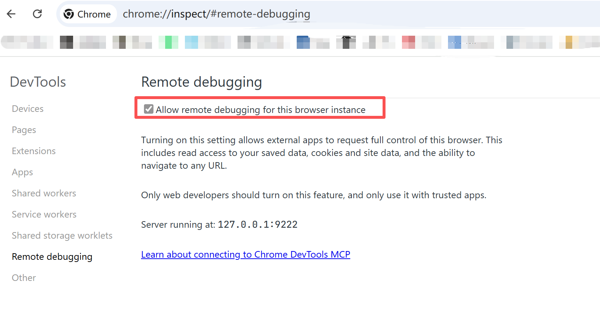

1. 增加mcp配置
```json
{
  "mcpServers": {
    "chrome-devtools": {
      "command": "npx",
      "args": [
        "chrome-devtools-mcp@latest",
        "-y",
        "--auto-connect"
      ]
    }
  }
}
```
需要开启`--auto-connect`

2. 开启chrome的远程debug配置
访问`chrome://inspect/#remote-debugging`
开启Allow remote debugging for this browser instance

