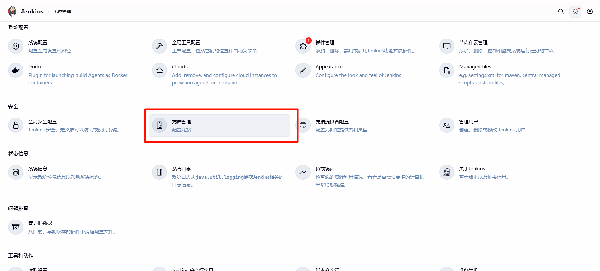
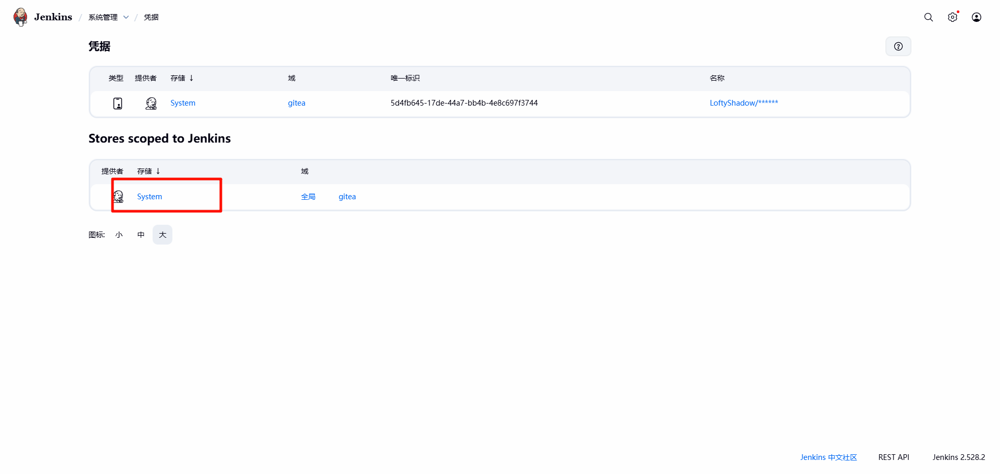
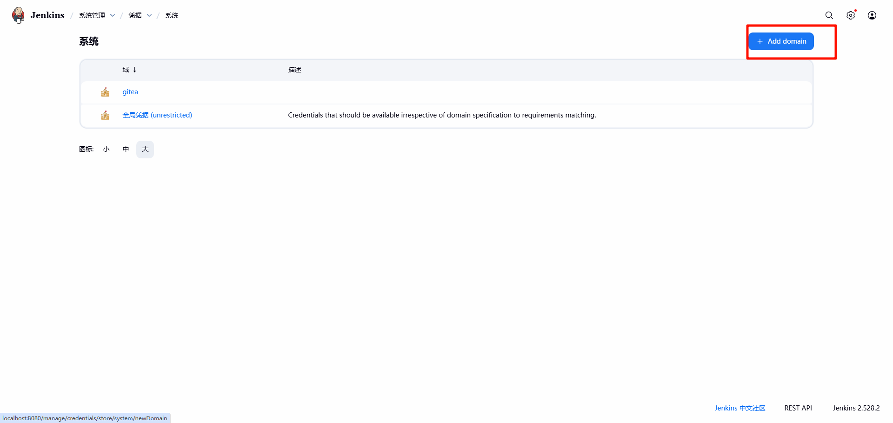
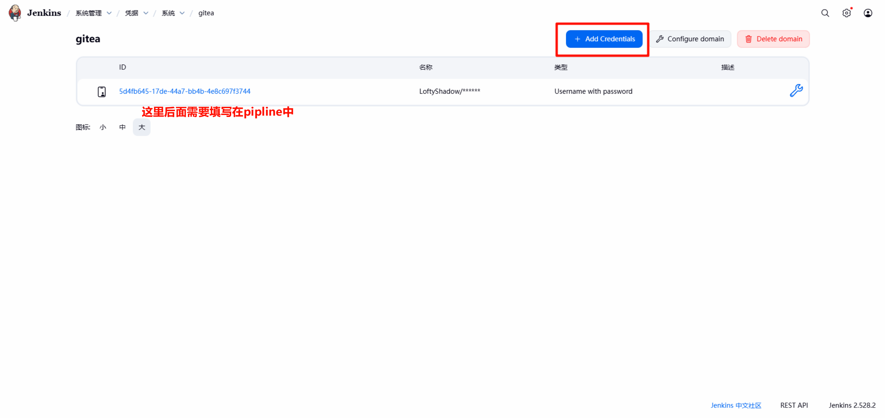
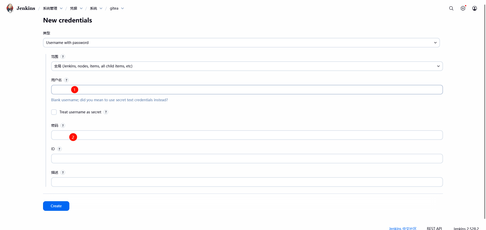
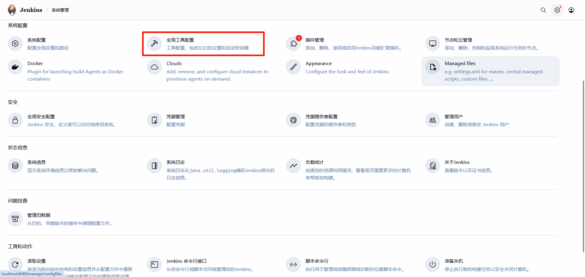
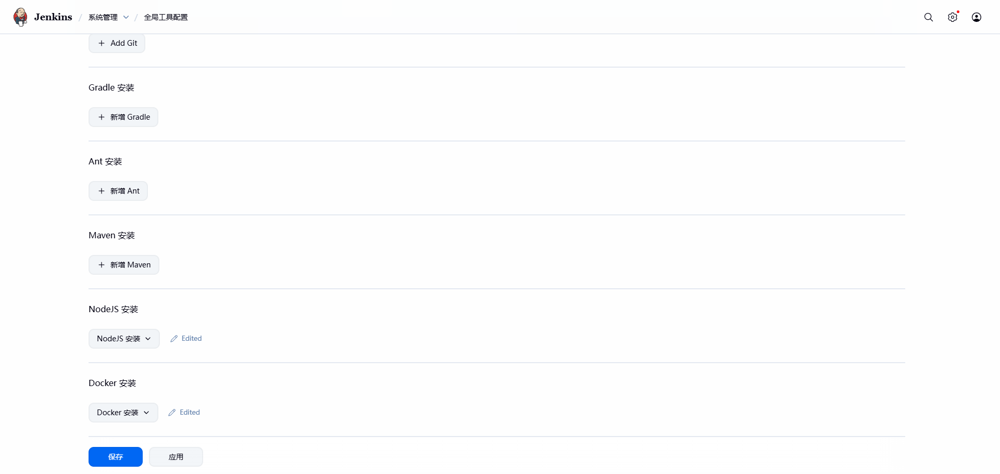

# Jenkins部署项目

## docker compose部署需要环境
<details>
<summary>docker-compose及其相关配置信息</summary>

```yaml
version: '3.8'

services:
  gitea:
    image: gitea/gitea:1.25
    container_name: gitea
    environment:
      - USER_UID=1000
      - USER_GID=1000
      - GITEA__database__DB_TYPE=mysql
      - GITEA__database__HOST=db:3306
      - GITEA__database__NAME=gitea
      - GITEA__database__USER=gitea
      - GITEA__database__PASSWD=gitea_password
    restart: always
    networks:
      - cicd-net
    volumes:
      - ./gitea/data:/data
      - /etc/timezone:/etc/timezone:ro
      - /etc/localtime:/etc/localtime:ro
    ports:
      - "3000:3000"   # Web UI
      - "2222:22"     # SSH（可选）
    depends_on:
      - db

  db:
    image: mysql:8.2
    container_name: gitea-db
    environment:
      MYSQL_ROOT_PASSWORD: root_password
      MYSQL_USER: gitea
      MYSQL_PASSWORD: gitea_password
      MYSQL_DATABASE: gitea
    restart: always
    networks:
      - cicd-net
    volumes:
      - ./gitea/mysql:/var/lib/mysql

  jenkins:
    image: jenkins/jenkins:lts-jdk21
    container_name: jenkins
    user: root  # 便于挂载权限（生产环境慎用）
    restart: always
    networks:
      - cicd-net
    volumes:
      - ./jenkins/home:/var/jenkins_home
      - /var/run/docker.sock:/var/run/docker.sock  # 可选：让 Jenkins 能调用宿主机 Docker
      # 和 Nginx 共享一个 volume，用来放构建后的 dist
      - web-root:/usr/share/nginx/html
    ports:
      - "8080:8080"
      - "50000:50000"  # Jenkins agent 端口

    # ============ Nginx，用来发布前端 ============
  nginx:
    image: nginx:1.29.4
    container_name: nginx
    restart: always
    networks:
      - cicd-net
    depends_on:
      - jenkins          # 只是确保 Jenkins 先起来，方便首次构建
    ports:
      - "80:80"          # 访问 http://localhost
    volumes:
      # 前端静态文件目录（和 Jenkins 共享）
      - web-root:/usr/share/nginx/html:ro
      # 自定义 Nginx 配置
      - ./nginx/conf.d:/etc/nginx/conf.d:ro

networks:
  cicd-net:
    driver: bridge

volumes:
  web-root:
```

nginx的default.conf配置
```text
server {
    listen 80;
    server_name localhost;

    # 前端静态资源根目录，对应 volume 里的 /usr/share/nginx/html
    root /usr/share/nginx/html;
    index index.html;

    # SPA 路由支持
    location / {
        try_files $uri $uri/ /index.html;
    }

    # 如有后端服务，这里可以做反向代理
    # location /api/ {
    #     proxy_pass http://your-backend:3001/;
    #     proxy_set_header Host $host;
    #     proxy_set_header X-Real-IP $remote_addr;
    # }

    # 可选：通过 Nginx 访问 Jenkins / Gitea（需要它们支持 prefix）
    location /jenkins/ {
        proxy_pass http://jenkins:8080/jenkins/;
        proxy_set_header Host $host;
        proxy_set_header X-Real-IP $remote_addr;
    }

    location /gitea/ {
        proxy_pass http://gitea:3000/;
        proxy_set_header Host $host;
        proxy_set_header X-Real-IP $remote_addr;
    }
}
```
</details>

## 配置Gitea密钥信息










## 配置其余打包工具环境





没有的可以查看是否有相关插件

## 编写pipline发布JekinsFile

<details>
<summary>pipline对应JekinsFile</summary>

```text
pipeline {
    agent any
   
    tools {
       nodejs 'NodeJS_24.11.1'
    }

    environment {
        // 环境变量保持不变，便于维护
        GIT_URL = 'http://gitea:3000/LoftyShadow/luffy-agent-frontend.git'
        GIT_BRANCH = 'main'
        GITEA_CREDENTIALS = '5d4fb645-17de-44a7-bb4b-4e8c697f3744'
    }

    stages {
        stage('Checkout Code') {
            steps {
                echo "开始从 Gitea 拉取代码..."
                // 确保工作空间是干净的，尽管使用了缓存，但清理旧文件仍是好习惯
                cleanWs() 
                git branch: env.GIT_BRANCH,
                    credentialsId: env.GITEA_CREDENTIALS,
                    url: env.GIT_URL
            }
        }

        stage('Build & Install Dependencies') {
            steps {

                echo "进入 Jenkins Master 容器执行 Node.js 任务..."
                sh '''
                    node -v
                    npm install -g yarn
                    yarn install
                '''
            }
        }

        stage('Compile & Package') {
            steps {
                echo "执行构建和打包命令..."
                // 建议：在 CI 环境中通常使用 'npm run build' 来生成用于部署的生产环境代码。
                // 如果 'npm run dev' 只是快速检查，可以保留；如果是正式打包，请改为 'npm run build'。
                sh 'yarn build:prod' 
            }
        }
        
        stage('Deploy to Nginx') {
            steps {
                sh '''
                  rm -rf /usr/share/nginx/html/*
                  mkdir -p /usr/share/nginx/html
                  cp -r dist/* /usr/share/nginx/html
                '''
            }
        }
        
    }
}
```
</details>

